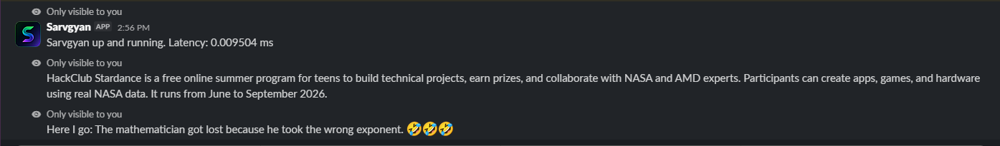

# Sarvgyan
A python built slack bot with the capability to do things like searching the web for you or telling you a joke.
 

## How to try?
You can test it in the slack channel `#test-sarvgyan` in the HackClub Workspace. [Channel link](https://app.slack.com/client/E09V59WQY1E/C0BNZ1V86HH)
 
All the available commands are mentioned there too.

## Features
All available commands along with their features:
- **`/sarvgyan-ping`**: Responds with the latency. 
- **`/sarvgyan-befunny`**: Tells a randomly sampled joke from a list of 5 jokes defined in the app. (btw the jokes are really unfunny)
- **`/sarvgyan-search <query>`**: Lets you run web search for the specific query sent and returns a short AI summary result for the search

## How it Works?
Listeners for each of the bot's commands are registered using `@app.command("/command")`. The communication between the app and slack servers is done via WebSocket Protocol. When a command is sent slack notifies the app with with command metadata and the respective command handler function is executed. 
 
For the WebSearch feature the app uses Tavily API, it makes a search request to the API with the given query accessed using `body['text']`. It responds with the result value of the received response to the user. 
## Credits
- [Tavily python package](https://docs.tavily.com/sdk/python/quick-start)
- [slack_bolt](https://docs.slack.dev/tools/bolt-python/) 
- [dotenv](https://pypi.org/project/python-dotenv/)

